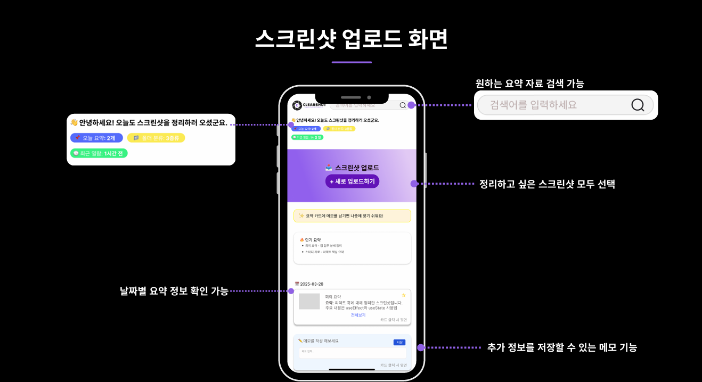
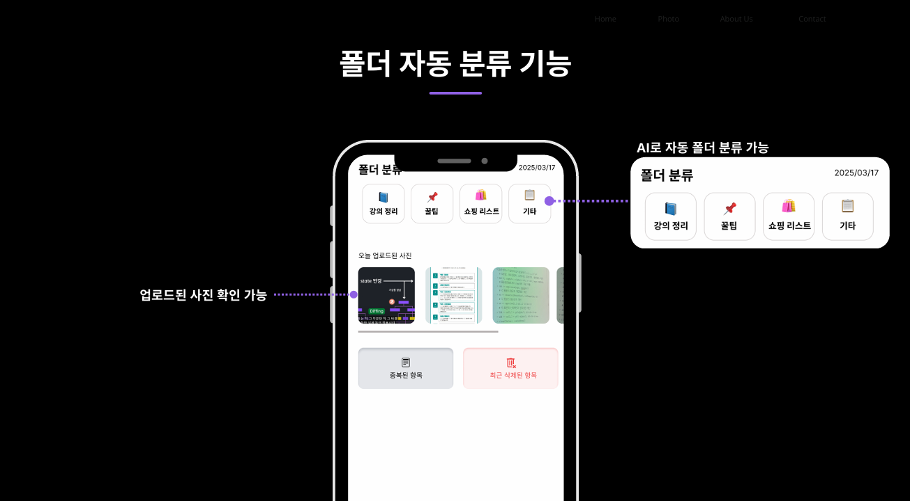
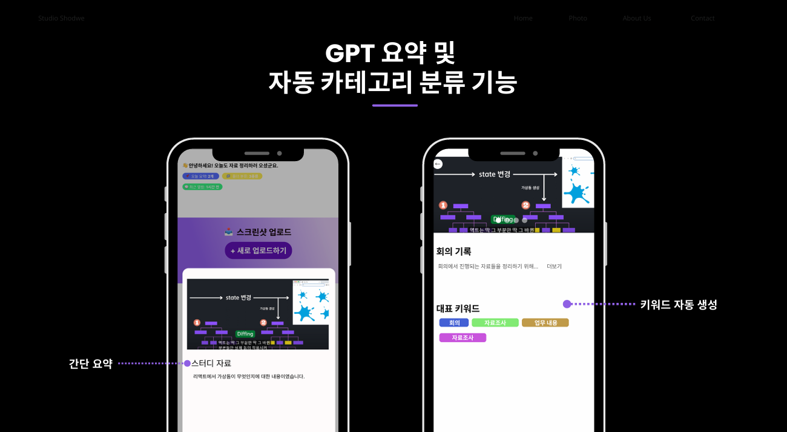
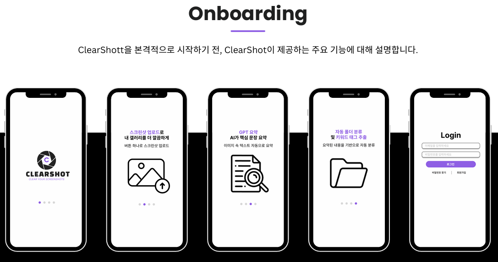

  

 

---

## ✍️ 프로젝트 개요

- **프로젝트명:** 자료요정 - 스크린샷 정리 자동화 서비스
- **프로젝트 기간:** 2025.03.25 ~ 2025.03.29
- **프로젝트 형태:** 단국대학교 해커톤 프로젝트
- **목표:** 사용자의 스크린샷 이미지 속 텍스트 정보를 자동으로 추출, 요약, 분류하여   효율적인 정보 관리와 접근성 향상을 실현하는 스마트 정리 시스템 구축
- **수상 내역**: 🥇 **대상 수상 (2025 제로톤)** 
- **주요 타겟 사용자:** 대학생, 직장인, 자영업자 

---

## ✍️ 프로젝트 소개

### 프로젝트 배경
**자료요정**은 많은 사용자들이 스마트폰으로 강의자료, 회의 내용, 설정 정보 등을 스크린샷으로 저장하지만,
나중에 다시 확인하려고 할 때 어떤 내용인지 기억하기 어렵고, 정리되지 않아 찾기 힘든 문제가 발생합니다.
이를 해결하기 위해, 스크린샷 이미지 안의 텍스트를 자동으로 추출하고,
OpenAI를 활용해 요약 + 카테고리 분류 + 폴더 저장까지 자동화하는 서비스를 기획하게 되었습니다.

기존의 스크린샷 정리 방식은 다음과 같은 문제점을 가지고 있었습니다:

1. **스크린샷을 많이 찍지만 정리가 되지 않음** 

2. **시간이 지나면 이미지 내용이 무엇이었는지 기억나지 않음** 

3. **중요한 정보가 이미지 속에 숨어 있음** 

---

## 🚀 프로젝트 목표

1. **스크린샷 데이터 자동 정리로 업무 효율성 향상**
- OCR 및 GPT 요약 기능으로 사용자의 수작업을 줄임

2. **사용자 중심의 직관적 정보 탐색 제공** 
- 키워드 검색, 자동 분류, 메모 기능 등으로 정보 접근 용이
3. **다양한 환경과 사용 사례에 대한 확장성 확보** 
- 대학생, 직장인, 자영업자 등 다양한 사용자 타깃
---

## 📌 주요 기능

<table>
  <tr>
    <th align="center">메인 페이지</th>
    <th align="center">폴더 페이지</th>
  </tr>
  <tr>
    <td align="center"></td>
    <td align="center"></td>
  </tr>
</table>

<table>
  <tr>
    <th align="center">GPT 요약 및 자동 카테고리 분류 기능</th>
    <th align="center">Onboarding (주요 기능 설명)</th>
  </tr>
  <tr>
    <td align="center"></td>
    <td align="center"></td>
  </tr>
</table>
 
---

## 🧑‍💻 팀원 소개

| **이름**      | **포지션**      |  **역할**                                      |
|---------------|------------------------|------------------------------------------------------|
| 김태우        | Project Manager        | 팀 총괄, React Native 기반 프론트엔드 개발, API 연동, UI·UX 구현&디자인            |
| 송유선        | Product Planner        | 서비스 기획, 아이디어 구상, 기획서 작성, 화면 흐름도 설계, UI·UX 구현&디자인, 발표 자료 제작          |
| 심연호        | Back-end Developer     | DB 설계, API 개발, AWS RDS 기반 DB 운영, OpenAI 연동                                  |
| 정윤성        | Back-end Developer     | 서버 구현, API 연동, 로직 처리, EC2 서버 배포, CI/CD 환경 구성                         |

---

## ⚙️ 기술 스택

<table>
  <thead>
    <tr>
      <th>분류</th>
      <th>기술 스택</th>
    </tr>
  </thead>
  <tbody>
    <tr>
      <td>기획</td>
      <td>
        
      </td>
    </tr>
    <tr>
      <td>디자인</td>
      <td>
      
      
      
      </td>
    </tr>
    <tr>
      <td>프론트엔드</td>
      <td>
        
        
         
      </td>
    </tr>
    <tr>
      <td>백엔드</td>
      <td>
        
        
        
        
      </td>
    </tr>
    <tr>
      <td>인프라</td>
      <td>
        
        
       
      </td>
    </tr>
  </tbody>
</table>

---

## 📂 문서 자료
- [프로젝트 노션](https://mini-shock-1ff.notion.site/1c3b0eecbf8381059df6d5b7776b838c?pvs=4)
- [PDF 보기](./assets/CLEARSHOT_제로톤_5팀.pdf)

---
